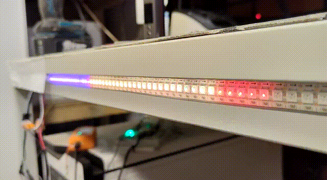

# tcp2leds
Control your WS2812 led strips through network



see [homeassistant_energy.py](examples/homeassistant_energy.py) and README section [HomeAssistant examples](#homeassistant-examples)

# How it works
- connect your WS2812 led strip to your rapsberry pi (act as server), see [wiring](#wiring-the-server)
- run `python3 tcp2leds.py` on your rapsberry pi as user `root` (`sudo python3 tcp2leds.py`)
- run your python script (or one from the examples) on the raspberry pi or other other network connected device (act as client)
- enjoy

# Wiring the server
## with external power supply
- i.e. 40W 5V 8A power suppy [MeanWell, LPV-60-24](https://www.amazon.de/gp/product/B00MWQF08C/)
- connect `+` (red) and `-` (black) from your external power supply with the shorter two wires `+` (red) and `-` (white) of your led strip
- connect the longer `-` (white) of your led strip with the GND of your raspberry pi
- connect the `data` (green) wire of your led strip with the PWN pin of your raspberry pi
- don't connect `+` with the raspberry pi! Only two wires go from the raspberry pi to the led strip!
- power up external power supply
- power up raspberry pi with USB-C

## without external power suppy (power supply via raspberry pi)
- connect the longer `+`, `-` and `data` wires of your led strip with your raspberry pi
- power up raspberry pi with USB-C

# Install server libraries

```
sudo apt-get update
sudo apt-get install gcc make build-essential python-dev git scons swig
sudo nano /etc/modprobe.d/raspi-blacklist.conf
```
Add line:
```
blacklist snd_bcm2835
```

```
sudo nano /boot/config.txt
```
Add comment/remove:
```
#dtparam=audio=on
```
Reboot:
```
sudo reboot
```
Install [rpi_ws281x](https://github.com/jgarff/rpi_ws281x)
```
cd ~/src/
git clone https://github.com/jgarff/rpi_ws281x
cd rpi_ws281x/
sudo scons
```

# Protocol
Each char represents a color of a led:

i.e. if you want to control the first 10 leds of your light strip, send 

```python
'rrrgggyyyi'
 rrr = led 1-3 red
    ggg = led 4-6 green
       yyy = led = 7-9 yellow
          i = led 10 iris
```

Possible color values:

- `-` dont set value, skips this led (keeps previous set value)
- `0` off
- `y` yellow
- `a` amber
- `r` red
- `b` blue
- `r` red
- `g` green
- `o` brown
- `p` purple
- `i` iris
- `p` orange

Feel free to contribute more color values.


# HomeAssistant examples

```python3
#!/usr/bin/python
# -*- coding: utf-8 -*-
import tcp2leds
import time
from tcp2leds.homeassistant import HomeAssistantPowerSection, \
    HomeAssistantPowerSOCSection
ltt = '<HomeAssistant Long-Time Token>'
hass_url = 'http://192.168.178.203:8123'
watt_per_led = 100
p = tcp2leds.LEDProgram('192.168.178.100', used_leds=140)
s1 = HomeAssistantPowerSection(
    'grid',
    hass_url,
    ltt,
    'sensor.powerfox_aktuell',
    value_per_led=watt_per_led,
    stage_colors=['b', 'y', 'r'],
    )
s2 = HomeAssistantPowerSOCSection(
    'battery',
    hass_url,
    ltt,
    'sensor.albXXXXXXXX_instantaneous_battery_i_o',
    value_per_led=watt_per_led,
    stage_colors=['p', 'i', 'r'],
    soc_entity_id='sensor.albXXXXXXXX_instantaneous_battery_soc',
    )
s3 = HomeAssistantPowerSection(
    'helper_sum_pv',
    hass_url,
    ltt,
    'sensor.helper_pv_sum_yaml',
    value_per_led=watt_per_led,
    stage_colors=['y', 'n', 'r'],
    )
s4 = HomeAssistantPowerSection(
    'helper_verbrauch_haus',
    hass_url,
    ltt,
    'sensor.helper_verbrauch_haus_yaml',
    value_per_led=watt_per_led,
    stage_colors=['o', 'a', 'r'],
    )
p.add_section(s1)
p.add_section(s2)
p.add_section(s3)
p.add_section(s4)
p.push_loop(update_sec=0.05)


```
